  

  
  

<h1 align="center">CatSuite</h1>

<strong>Your lab for web, APIs and QA. On Android.</strong>

  
  

## From browsing to evidence

**CatSuite**, created by **NetCatTest**, brings web analysis, traffic inspection and API testing tools together in an Android app. A place to understand application behavior, investigate responses and organize technical work from your phone.

**Browse → Capture → Inspect → Test → Document**

## What you can do

- **Browser + Interceptor:** browse, review requests and responses, and follow session traffic.
- **Repeater:** edit HTTP calls, resend them and compare responses.
- **Intruder:** build test scenarios with parameters, payloads and wordlists.
- **Discoverer:** investigate paths and endpoints within your defined scope.
- **Decoder + SSL/TLS:** interpret formats and examine certificates and connections.
- **History + Notes:** keep observations, results and analysis context together.

## Built for people who investigate

Developers, QA professionals, security analysts and students get a workflow designed for mobile use, with a **Brazilian Portuguese and English** interface and control over session actions.

Use it on your own projects, labs, CTFs and authorized environments.

## Start with the app

1. [Open CatSuite on Google Play](https://play.google.com/store/apps/details?id=br.com.netcattest.catsuite.app).
2. Choose your test environment and define the scope.
3. Browse, inspect messages and pick the right tool for each step.

## Official links

- [CatSuite — official website](https://netcattest.com/catsuite)
- [CatSuite — Google Play](https://play.google.com/store/apps/details?id=br.com.netcattest.catsuite.app)
- [NetCatTest](https://netcattest.com)

## Downloads and source code

### CatSuite Studio · VS Code

Create, edit and validate CatSuite plugins in VS Code, with SDK command suggestions and tools to prepare your packages.

  
  

**[Source code → catsuite-vscode](./catsuite-vscode/)**

[Install CatSuite Studio 1.2.0 from VSIX](https://github.com/netcattest/catsuite/releases/download/tools-1.2.0/catsuite-studio-1.2.0.vsix) · [SHA-256](https://github.com/netcattest/catsuite/releases/download/tools-1.2.0/SHA256SUMS.txt)

[Install from the VS Code Marketplace](https://marketplace.visualstudio.com/items?itemName=NetCatTest.catsuite-studio).

After downloading the VSIX, open **Extensions → ⋯ → Install from VSIX** in VS Code and select the file. To install from the Marketplace, use the button above or `code --install-extension NetCatTest.catsuite-studio`.

### CatBridge

Connect CatSuite to tools on your computer or server through authorized capabilities and signed communication.

  
  

**[Source code → catbridge](./catbridge/)**

[Windows 64-bit](https://github.com/netcattest/catsuite/releases/download/tools-1.2.0/catbridge-windows-amd64.zip) · [Linux 64-bit](https://github.com/netcattest/catsuite/releases/download/tools-1.2.0/catbridge-linux-amd64.tar.gz) · [Usage](./catbridge/README.en.md) · [SHA-256](https://github.com/netcattest/catsuite/releases/download/tools-1.2.0/SHA256SUMS.txt)

CatBridge is portable: extract the ZIP on Windows or the TAR.GZ on Linux and open a terminal in the extracted folder. Each package includes the executable, bilingual instructions, licenses and preparation resources. External tools require separate installation and authorization.

---

<strong>CatSuite · A NetCatTest project</strong> Security, in your hands.

<a href="README.md">Português brasileiro</a> · <a href="assets/capa-en.svg">SVG cover</a> · <a href="assets/capa-en.png">PNG cover</a>

