  

  
  

<h1 align="center">CatSuite</h1>

<strong>Seu laboratório para web, APIs e QA. No Android.</strong>

  
  

## Da navegação à evidência

O **CatSuite**, criado pela **NetCatTest**, reúne ferramentas de análise web, inspeção de tráfego e testes de APIs em um aplicativo Android. Um espaço para entender o comportamento das aplicações, investigar respostas e organizar o trabalho técnico pelo celular.

**Navegar → Capturar → Inspecionar → Testar → Documentar**

## O que você pode fazer

- **Navegador + Interceptador:** navegar, revisar requisições e respostas e acompanhar o tráfego da sessão.
- **Repetir:** editar chamadas HTTP, reenviar e comparar respostas.
- **Intruso:** montar cenários com parâmetros, payloads e wordlists.
- **Descobridor:** investigar caminhos e endpoints dentro do escopo definido.
- **Decodificar + SSL/TLS:** interpretar formatos e examinar certificados e conexões.
- **Histórico + Notas:** manter observações, resultados e contexto da análise.

## Feito para quem investiga

Desenvolvedores, profissionais de QA, analistas de segurança e estudantes encontram um fluxo de trabalho pensado para o celular, com interface em **português brasileiro e inglês** e controle sobre as ações da sessão.

Use nos seus projetos, laboratórios, CTFs e ambientes com autorização.

## Comece pelo aplicativo

1. [Abra o CatSuite na Google Play](https://play.google.com/store/apps/details?id=br.com.netcattest.catsuite.app).
2. Escolha seu ambiente de teste e defina o escopo.
3. Navegue, analise as mensagens e use a ferramenta adequada para cada etapa.

## Links oficiais

- [CatSuite — apresentação oficial](https://netcattest.com/catsuite)
- [CatSuite — Google Play](https://play.google.com/store/apps/details?id=br.com.netcattest.catsuite.app)
- [NetCatTest](https://netcattest.com)

## Downloads e código fonte

### CatSuite Studio · VS Code

Crie, edite e valide plugins do CatSuite no VS Code, com sugestões dos comandos do SDK e ferramentas para preparar seus pacotes.

  
  

**[Código fonte → catsuite-vscode](./catsuite-vscode/)**

[Instalar CatSuite Studio 1.2.0 pelo VSIX](https://github.com/netcattest/catsuite/releases/download/tools-1.2.0/catsuite-studio-1.2.0.vsix) · [SHA-256](https://github.com/netcattest/catsuite/releases/download/tools-1.2.0/SHA256SUMS.txt)

[Instalar pelo VS Code Marketplace](https://marketplace.visualstudio.com/items?itemName=NetCatTest.catsuite-studio).

Depois de baixar o VSIX, abra no VS Code **Extensões → ⋯ → Instalar do VSIX** e selecione o arquivo. Para instalar pelo Marketplace, use o botão acima ou `code --install-extension NetCatTest.catsuite-studio`.

### SDK de extensões · 1.4.0

Código do SDK, tipos da API, esquemas, quinze exemplos editáveis e seis modelos de fluxos para criar plugins do CatSuite.

[Explorar o SDK](./sdk/) · [Baixar SDK ZIP](https://github.com/netcattest/catsuite/releases/download/sdk-1.4.0/catsuite-sdk-1.4.0.zip) · [SHA-256](https://github.com/netcattest/catsuite/releases/download/sdk-1.4.0/SHA256SUMS.txt)

### CatBridge

Conecte o CatSuite às ferramentas do seu computador ou servidor, com capacidades autorizadas e comunicação assinada.

  
  

**[Código fonte → catbridge](./catbridge/)**

[Windows 64 bits](https://github.com/netcattest/catsuite/releases/download/tools-1.2.0/catbridge-windows-amd64.zip) · [Linux 64 bits](https://github.com/netcattest/catsuite/releases/download/tools-1.2.0/catbridge-linux-amd64.tar.gz) · [Como usar](./catbridge/README.md) · [SHA-256](https://github.com/netcattest/catsuite/releases/download/tools-1.2.0/SHA256SUMS.txt)

O CatBridge é portátil: extraia o ZIP no Windows ou o TAR.GZ no Linux e abra um terminal na pasta extraída. O pacote inclui o executável, instruções nos dois idiomas, licenças e recursos de preparação. Ferramentas externas exigem instalação e autorização separadas.

---

<strong>CatSuite · Um projeto NetCatTest</strong> Segurança na palma da mão.

<a href="README.en.md">English</a> · <a href="assets/capa-pt-BR.svg">Capa SVG</a> · <a href="assets/capa-pt-BR.png">Capa PNG</a>

